# AI-Based Real-Time Stress Detection and Monitoring System
**DESKTOP APPLICATION (.exe)**

**⚠️ IMPORTANT: This is a STANDALONE DESKTOP APPLICATION, NOT a web application.**

A comprehensive **standalone Windows desktop application** for detecting and monitoring stress levels of IT professionals using AI-powered facial analysis and emotion recognition. This application runs as a native Windows program - no web browser or web server required.

**✅ PRODUCTION-READY**: This is a fully functional production application with **100% dynamic data storage and interfaces**. All data is stored in MongoDB and all interfaces display real-time data from the database. No demo data or hardcoded content.

---

## 📋 Table of Contents
1. [Features](#features)
2. [Tech Stack](#tech-stack)
3. [System Workflow](#system-workflow)
4. [Project Structure](#project-structure)
5. [AI & Machine Learning Models](#ai--machine-learning-models)
6. [Installation](#installation)
7. [Building Executable](#building-executable)
8. [Usage & Account Management](#usage--account-management)
9. [Detailed Feature Breakdown](#detailed-feature-breakdown)
10. [Troubleshooting & Support](#troubleshooting--support)

---

## <a name="features"></a>✨ Features

### Core Functionality
- **Real-time Face Detection**: Automatic webcam access and continuous face tracking.
- **Advanced Emotion Tracking**: Classifies 5 emotions (Neutral, Happy, Sad, Angry, Stressed) with history and trends.
- **Stress Level Classification**: Real-time detection of Low, Medium, and High stress levels.
- **Role-Based Access Control**: Secure three-tier system (Employee, Manager, Administrator).
- **Manager Dashboard**: Real-time monitoring of employee stress levels with color-coded status.
- **Automated Alerts**: Smart notifications for employees and managers based on stress thresholds.
- **Stress Relief Recommendations**: AI-generated personalized suggestions (Powered by Google Gemini).
- **Profile Management**: Privacy-focused profile handling.
- **Privacy-Focused**: No raw facial data storage, only metadata is saved.

### Advanced Capabilities
- **Generative AI Integration**: Personalized stress relief tips.
- **Trend Analysis**: Detects emotion and stress patterns over time (e.g., prolonged stress).
- **Intensity Tracking**: Monitors emotion intensity and confidence levels.
- **Session Tracking**: Tracks emotions throughout work sessions.
- **Real-Time Insights**: Instant feedback and visual analytics.

---

## <a name="tech-stack"></a>🛠️ Tech Stack

- **GUI Framework**: PyQt6
- **Programming Language**: Python 3.10+
- **Database**: MongoDB (NoSQL)
- **Computer Vision**: OpenCV, MediaPipe
- **AI/ML**: DeepFace (TensorFlow/Keras), Google GenAI
- **Build Tool**: PyInstaller
- **Authentication**: JWT, Bcrypt

---

## <a name="system-workflow"></a>🔄 System Workflow

### High-Level Flow
The following diagram illustrates the complete flow from Login to Stress Detection.

```mermaid
graph TD
    %% ==========================================
    %% 🎨 STYLING DEFINITIONS
    %% ==========================================
    classDef startend fill:#212121,stroke:#000,stroke-width:2px,color:#fff;
    classDef process fill:#e3f2fd,stroke:#1565c0,stroke-width:2px,color:#000;
    classDef decision fill:#fff9c4,stroke:#fbc02d,stroke-width:2px,color:#000;
    classDef io fill:#e0f2f1,stroke:#00695c,stroke-width:2px,color:#000;
    classDef database fill:#f3e5f5,stroke:#7b1fa2,stroke-width:2px,color:#000;
    classDef alert fill:#ffebee,stroke:#c62828,stroke-width:2px,color:#000;

    Start([🚀 Start Application]):::startend --> Spash[Show Splash Screen]:::io
    Spash --> CheckDB{Checking MongoDB...}:::decision
    
    CheckDB -- Error --> DBError[Show Connection Error Dialog]:::alert
    DBError --> RetryDB{Retry?}:::decision
    RetryDB -- Yes --> CheckDB
    RetryDB -- No --> Exit([Exit App]):::startend

    CheckDB -- Connected --> LoginUI[🖥️ Display Login Window]:::io
    
    LoginUI --> UserAction{User Interaction}:::decision

    %% --- LOGIN SUB-FLOW ---
    UserAction -- Enter Credentials --> AuthProc[Authenticating...]:::process
    AuthProc --> FetchUser{Query User DB}:::database
    
    FetchUser -- Not Found --> LoginFail[❌ Show 'User Not Found']:::alert
    LoginFail --> LoginUI
    
    FetchUser -- Found --> VerifyPass{Check User Status}:::decision
    VerifyPass -- Inactive --> AccountLocked[🔒 Show 'Account Pending Approval']:::alert
    AccountLocked --> LoginUI

    VerifyPass -- Active --> CheckPass{Verify Password}:::process
    CheckPass -- Invalid --> PassFail[❌ Show 'Invalid Password']:::alert
    PassFail --> LoginUI

    CheckPass -- Valid --> GenToken[🔑 Generate Session Token]:::process
    GenToken --> DetermineRole{Determine User Role}:::decision

    %% ==========================================
    %% 👨‍💻 EMPLOYEE WORKFLOW
    %% ==========================================
    DetermineRole -- Employee --> EmpDash[👤 Open Employee Dashboard]:::io
    
    subgraph "Real-Time Monitoring Loop"
        EmpDash --> InitCam[📷 Initialize Webcam]:::process
        InitCam --> ReadFrame[Read Video Frame]:::process
        ReadFrame --> FaceDet[🤖 MediaPipe: Face Detection]:::process
        
        FaceDet -- Find Face --> ExtractLMs[📐 Extract 468 Landmarks]:::process
        ExtractLMs --> CalcPhysio[🧮 Calculate: Blink, Mouth, Eye Closure]:::process
        
        CalcPhysio --> DeepFace[🧠 DeepFace CNN: Emotion Recognition]:::process
        DeepFace --> CalcStress["📊 Calculate Stress Score (0.0 - 1.0)"]:::process
        
        CalcStress --> SaveRecord[💾 Save Stress Record to DB]:::database
        SaveRecord --> UpdateUI[📈 Update Live Graph & Stats]:::io
        
        UpdateUI --> StressCheck{Stress Level Check}:::decision
        StressCheck -- High/Medium --> TrigAlert[🚨 Trigger Pop-up Alert]:::alert
        TrigAlert --> ShowRec[💡 Show Health Recommendation]:::io
        ShowRec --> ReadFrame
        
        StressCheck -- Low --> ReadFrame
    end
    
    %% ==========================================
    %% 👔 MANAGER WORKFLOW
    %% ==========================================
    DetermineRole -- Manager --> MgrDash[👔 Open Manager Dashboard]:::io
    
    MgrDash --> FetchTeam[👥 Fetch Assigned Employees]:::database
    FetchTeam --> RenderTeam[Show Team Grid Output]:::io
    
    subgraph "Manager Monitoring"
        RenderTeam --> AutoRefresh[🔄 Poll DB every 5s]:::process
        AutoRefresh --> CheckStatus{Analyze Latest Records}:::decision
        
        CheckStatus -- High Stress --> HighlightRed[🔴 Highlight Employee Red]:::alert
        CheckStatus -- Medium Stress --> HighlightYellow[🟡 Highlight Employee Yellow]:::alert
        CheckStatus -- Low Stress --> HighlightGreen[🟢 Highlight Employee Green]:::process
        
        HighlightRed --> NotifyMgr[🔔 Send Desktop Notification]:::alert
    end
    
    %% ==========================================
    %% 🛡️ ADMIN WORKFLOW
    %% ==========================================
    DetermineRole -- Admin --> AdminPanel[🛡️ Open Admin Panel]:::io
    
    AdminPanel --> FetchAllUsers[📂 Fetch All Users]:::database
    FetchAllUsers --> UserTable[Show User Management Table]:::io
    
    subgraph "User Management"
        UserTable --> AdminAction{Actions}:::decision
        AdminAction -- Add User --> AddUserForm[➕ Add New User]:::io
        AdminAction -- Edit User --> EditDialog[✏️ Edit User Details]:::io
        AdminAction -- Delete --> RemoveUser[❌ Delete from DB]:::database
        AdminAction -- Approve --> ActivateAcc[✅ Set Active = True]:::database
        AdminAction -- Assign Mgr --> MapRel[🔗 Link Employee to Manager]:::database
    end
```



---

## <a name="project-structure"></a>📂 Project Structure

This section provides a technical overview of the significant files in the project.

### 📂 Root Directory
- **`main.py`**: Bootstrapper. Initializes `QApplication`, connects to MongoDB, and launches instructions.
- **`setup_database.py`**: Database migration/seeding script. Creates indexes and initial Admin user.
- **`build_exe.py`**: Script to compile the Python project into a standalone `.exe` using PyInstaller.
- **`requirements.txt`**: Lists all Python dependencies.

### 📂 `core/` - The Intelligence Layer
- **`emotion_recognition.py`**: Detects emotions using **DeepFace (CNN)**.
- **`face_detection.py`**: Detects 468 3D landmarks using **MediaPipe**.
- **`stress_analyzer.py`**: Computes "Stress Score" using Weighted Heuristic Inference: `Stress = (Weights * Emotion_Score) + (Weights * Physiological_Strain)`.
- **`auth.py`**: Manages secure login (Bcrypt), registration, and session tokens (JWT).
- **`error_handler.py`**: Centralized error management system.

### 📂 `ui/` - The Presentation Layer (PyQt6)
- **`login_window.py`**: Entry point for Login/Signup.
- **`employee_dashboard.py`**: Main interface for employees. Embeds webcam feed and real-time stress graph.
- **`manager_dashboard.py`**: Team oversight. Polls `StressRecord` documents every 5 seconds to update UI traffic lights.
- **`admin_panel.py`**: User management (CRUD) for Admins.
- **`analytics_tab.py`**: Visualization of historical data using Matplotlib.

### 📂 `models/` - The Data Layer (MongoDB)
- **`user.py`**: Python representation of a User document (`_id`, `email`, `role`, `manager_id`).
- **`stress_record.py`**: Stores a snapshot of user's stress state (`stress_level`, `emotion_data`, `facial_features`).
- **`alert.py`**: Stores generated alerts for the notification system.

---

## <a name="ai--machine-learning-models"></a>🧠 AI & Machine Learning Models

### 1. Emotion Recognition (Convolutional Neural Network)
- **Library**: `deepface` (Keras/TensorFlow)
- **Architecture**: Deep CNN (VGG-Face / Facenet).
- **Function**: Extracts features (edges, textures) from face crops to output a probability distribution across emotion classes.

### 2. Face & Feature Tracking (Graph Neural Network)
- **Library**: `mediapipe`
- **Architecture**: BlazeFace + Attention Mesh.
- **Function**: Real-time extraction of 468 3D facial landmarks to calculate physics-based metrics (eye closure, mouth tension).

### 3. Stress Logic (Heuristic Fusion)
- **Type**: Expert System / Rule-Based.
- **Logic**: 
  > Stress = (0.25 × Eye Fatigue) + (0.25 × Mouth Tension) + (0.20 × Blink Rate) + (0.15 × Eyebrow Pos) + (0.15 × Negative Emotion)
- **Why**: Combines physiological signals with emotional state for a robust workplace stress metric.

---

## <a name="detailed-feature-breakdown"></a>Detailed Feature Breakdown

### Stress Detection System
- **Low Stress (0.0 - 0.5)**: 🟢 Green. Normal state. Recommendation: Sustain good habits.
- **Medium Stress (0.5 - 0.75)**: 🟡 Yellow. Moderate tension. Recommendation: Take a short break, breathe.
- **High Stress (0.75 - 1.0)**: 🔴 Red. Critical level. Alerts Sent. Recommendation: Immediate break, step away.

### Privacy & Security
- **No Face Storage**: Original images are processed in RAM to extract numbers (landmarks) and then discarded immediately. They are NEVER saved to disk or DB.
- **Encryption**: Passwords hashed with Bcrypt. API keys stored in `.env`.
- **Session**: JWT tokens ensuring secure, time-limited access.

---

## <a name="deep-dive"></a>📂 Deep Dive: Codebase & Algorithms

This section provides a deep technical explanation of the core files, focusing on the implementation details and AI models used.

### 1. `core/emotion_recognition.py` (The AI Brain)
* **Purpose**: This file is responsible for determining the user's emotional state from the video feed.
* **Algorithm**: **Deep Convolutional Neural Network (CNN)**.
* **Library Used**: `deepface`.
* **Implementation Details**:
    - **Initialization**: The `_initialize_model` method attempts to load the `DeepFace` library. If unavailable, it falls back to a rule-based system (checking eyebrow/mouth positions).
    - **Pre-processing**: The `preprocess_face` method takes the detected face region, resizes it to 48x48 pixels (standard input size for emotion CNNs), converts it to grayscale, and normalizes pixel values to [0, 1].
    - **Inference (`recognize_emotion`)**:
        - It calls `DeepFace.analyze(actions=['emotion'])` which runs the image through a pre-trained VGG-Face or Facenet model.
        - The model returns a probability distribution across 7 emotions (angry, disgust, fear, happy, sad, surprise, neutral).
    - **Stress Calculation**: It calculates a `stress_score` by aggregating negative emotions (Angry + Fear + Sad + Disgust).
    - **Hybrid Logic**: The final score is a weighted average: `(DeepFace_Score * 0.7) + (Physiological_Score * 0.3)`. This ensures that even if the AI misses a subtle expression, physical signs like rapid blinking still contribute to the score.

### 2. `core/face_detection.py` (The Eyes)
* **Purpose**: Detects faces and extracts precise 3D landmarks (geometry).
* **Algorithm**: **BlazeFace** (Detector) + **Face Mesh** (Landmarker).
* **Library Used**: `mediapipe` (Google).
* **Implementation Details**:
    - **Initialization**: Loads `face_landmarker.task` which contains the TFLite models. It configures the detector to run in `VIDEO` or `IMAGE` mode.
    - **Detection (`detect_face`)**:
        - Converts the BGR OpenCV frame to RGB.
        - Runs the MediaPipe `detect` pipeline.
        - Returns a set of 478 3D landmarks (x, y, z).
    - **Feature Extraction (`_extract_features`)**:
        - **Blink Rate**: Calculates the Eye Aspect Ratio (EAR) using landmarks 159/145 (Vertical) vs 33/133 (Horizontal). If EAR drops below a threshold, it counts as a blink/closed eye.
        - **Mouth Tension**: Measures the ratio of mouth width to height. A thin, wide mouth indicates tension/stress.
        - **Eye Fatigue**: Derived from the inverse of the Blink Rate (frequent blinking or prolonged closure = fatigue).
        - **Eyebrow Position**: Uses landmarks 107/336 to detect furrowed brows (sign of anger/concentration).

### 3. `core/stress_analyzer.py` (The Expert System)
* **Purpose**: Fuses data from Emotion Recognition and Face Detection to output a single "Stress Level".
* **Algorithm**: **Weighted Heuristic Inference**.
* **Implementation Details**:
    - **Inputs**: Receives `emotion_data` (from DeepFace) and `facial_features` (from MediaPipe).
    - **Formula**:
      ```python
      Final_Score = (Emotion_Score * 0.4) +
                    (Eye_Fatigue * 0.2) +
                    (Mouth_Tension * 0.2) +
                    ((1 - Blink_Rate) * 0.2)
      ```
    - **Classification (`classify_stress`)**:
        - If `score >= 0.75` → **HIGH** (Red).
        - If `score >= 0.50` → **MEDIUM** (Yellow).
        - Else → **LOW** (Green).
    - **Trend Analysis**: The `get_stress_trend` method looks at the last N records to determine if stress is "Increasing", "Decreasing", or "Stable".

### 4. `core/emotion_tracker.py` (The Stabilizer)
* **Purpose**: Prevents "jitter" in emotion readings. Raw AI outputs can flicker (e.g., Happy -> Neutral -> Happy) in milliseconds. This module smooths that data.
* **Algorithm**: **Moving Average / Temporal Smoothing**.
* **Implementation Details**:
    - **Buffer**: Uses a `collections.deque` (circular buffer) to store the last N frames.
    - **Smoothing**: The `_update_current_emotion` method calculates the most frequent emotion in the buffer. The displayed emotion only changes if the new emotion persists for a set duration (e.g., 0.5s).
    - **History Tracking**: Maintains a list of records for session statistics (e.g., "You were happy for 45% of this session").

### 5. `core/auth.py` (The Gatekeeper)
* **Purpose**: Manages security, authentication, and user sessions.
* **Library Used**: `PyJWT` (Tokens), `bcrypt` (Hashing).
* **Implementation Details**:
    - **Login (`login`)**:
        1. Fetches user from MongoDB (`User.find_by_email`).
        2. Verifies password using `bcrypt.checkpw` (compares input against stored hash).
        3. Checks if `is_active=True`.
        4. Generates a **JWT** (JSON Web Token) signed with the `JWT_SECRET`.
    - **Token Verification**: The `verify_token` decorator is used on protected routes/functions to ensure the user has a valid, non-expired session.

### 6. `ui/employee_dashboard.py` (The Interface)
* **Purpose**: The main GUI for the end-user.
* **Library Used**: `PyQt6`.
* **Implementation Details**:
    - **Threading**: Uses `QThread` (`ModelLoaderThread`) to load heavy AI models in the background so the UI doesn't freeze on startup.
    - **Timers**:
        - `video_timer` (33ms): Captures webcam frames (30 FPS).
        - `ui_timer` (100ms): Updates the visual overlay (bounding box).
        - `analysis_timer` (10s): Runs the deep analysis (DeepFace) and saves to DB. This separation allows smooth video (30 FPS) while not overloading the CPU with heavy AI (0.1 FPS).
    - **Visuals**: Draws the "Scanning" overlay using OpenCV drawing functions (`cv2.line`, `cv2.rectangle`) directly onto the frame buffer.

### 7. `ui/manager_dashboard.py` (The Supervisor)
* **Purpose**:  Allows managers to monitor the real-time stress status of their assigned team members.
* **Key Features**:
    - **Live Status Table**: Auto-refreshes every 5 seconds (`QTimer`) to show the latest stress levels (Green/Yellow/Red) of employees.
    - **Drill-Down View**: Double-clicking an employee opens the `EmployeeDetailsWindow` which renders historical charts and statistics.
    - **Team Analytics**: A dedicated tab showing aggregated stats (e.g., "Team Average Stress", "High Stress Count").

### 8. `ui/admin_panel.py` (The Control Center)
* **Purpose**: Provides full control over the system users and configuration.
* **Key Features**:
    - **User CRUD**: Interfaces to Add, Edit, or Deactivate users, and assign Managers to Employees.
    - **System Config**: Allows changing global thresholds (e.g., setting High Stress from 0.75 to 0.80) dynamically without restarting the server.
    - **Analytics**: Uses `Matplotlib` embedded in PyQt to show organization-wide health trends.

### 9. `models/user.py` (The Data Model)
* **Purpose**: Abstraction layer for MongoDB user documents.
* **Key Features**:
    - **Security**: Handles password hashing using `bcrypt`. Passwords are never stored in plain text.
    - **ID Generation**: Implements a sequential ID generator (`generate_next_employee_id`) to create readable IDs like `EMP001`, `EMP002`.
    - **Relationships**: Manages the many-to-many relationship betweens Managers and Employees via the `manager_ids` array.

### 10. `utils/recommendations.py` (The AI Couselor)
* **Purpose**: Generates actionable advice based on stress levels.
* **Algorithm**: **Hybrid (Generative AI + Static Heuristics)**.
* **Implementation Details**:
    - **Primary (GenAI)**: If a `GEMINI_API_KEY` is present, it calls the **Google Gemini-2.0-Flash** model with a prompt like: *"I am stressed (Level: High) and sad. Give me one short relief tip."*
    - **Fallback (Static)**: If offline or no key, it selects from a curated list of psychological interventions (e.g., "4-7-8 Breathing", "20-20-20 Rule for eye strain").

### 11. `ui/login_window.py` (The Entry Point)
* **Purpose**: Handles user authentication and new account registration.
* **Key Features**:
    - **Secure Login**: Accepts Email/Password and validates via `AuthManager`.
    - **Registration**: Includes real-time validation for email format and password matching.
    - **Visuals**: Clean, centered card design with toggle-visibility for password fields.

### 12. `ui/analytics_tab.py` (The Insights Engine)
* **Purpose**: A reusable component used by both Admin and Manager dashboards to visualize data.
* **Libraries**: `matplotlib` (Charts), `PyQt6` (Embedding).
* **Key Features**:
    - **Polymorphic Data**: Automatically adapts data scope. If loaded by Admin, it shows chart for *All Users*. If Manager, it filters for *My Team*.
    - **Donut Chart**: Visualizes the distribution of Low/Medium/High stress events.
    - **Live Logs**: Shows a real-time table of recent stress events in the system.

### 13. `models/alert.py` (The Notification Logic)
* **Purpose**: Manages the creation and retrieval of stress alerts.
* **Key Features**:
    - **Cooldown Logic**: The `check_cooldown` method ensures a user isn't spammed with alerts every 10 seconds. It checks if an alert of the same type was sent in the last N minutes.
    - **Role Routing**: Flags alerts as `is_employee_notified` or `is_manager_notified` to support different notification queues.

### 14. `models/system_config.py` (Dynamic Settings)
* **Purpose**: Allows the application behavior to be tuned without code changes.
* **Key Features**:
    - **Database Backed**: Stores settings (e.g., "High Stress Threshold = 0.8") in MongoDB, not a text file. This allows Admin to change sensitivity instantly from the UI.
    - **Singleton-like Access**: The `get_config` method fetches the effective configuration, creating defaults if missing.

### 15. `config/database.py` (The Backbone)
* **Purpose**: Manages the connection to MongoDB.
* **Pattern**: **Singleton**.
* **Key Features**:
    - **Robust Connecting**: Handles `ServerSelectionTimeout` and `ConnectionFailure` gracefully.
    - **Global Access**: Exports a single `db` instance used by all Models, ensuring a centralized connection pool.

## <a name="documentation-reference"></a>📚 File Reference (Documentation)

The repository includes specialized guides for specific tasks:

| File | Purpose |
|------|---------|
| `QUICK_START.md` | 🚀 **Start Here**. The fastest way to run the app locally (5 minutes). |
| `DOCKER_GUIDE.md` | 🐳 Comprehensive guide for containerizing the application using Docker and Docker Compose. |
| `DEPLOYMENT_GUIDE.md` | ☁️ Instructions for deploying to a production environment (VPS, Cloud). |
| `ERROR_HANDLING_GUIDE.md` | 🛠 Troubleshooting common errors and explanation of the logging system. |
| `DYNAMIC_APPLICATION_GUIDE.md` | 🔄 Explanation of the dynamic data architecture (MongoDB-driven UI). |

### 16. `main.py` (The Bootcamp)
* **Purpose**: Application Entry Point.
* **Key Features**:
    - **Environment Setup**: Suppresses TensorFlow/Keras warnings for a clean console.
    - **Theme Enforcement**: Forces a "Fusion" style with a custom Light Palette to ensure the app looks consistent on all Windows versions.
    - **Routing logic**: Decides whether to show the Employee, Manager, or Admin dashboard based on the logged-in user's role.

### 17. `ui/styles.py` (The Design System)
* **Purpose**: Centralized source of truth for the "Premium" look and feel.
* **Key Features**:
    - **CSS Injection**: Contains static methods like `get_global_style()` that inject QSS (Qt Style Sheets) into the entire application.
    - **Tokenized Colors**: Uses constants like `Theme.PRIMARY` (Royal Blue) and `Theme.SURFACE` (Off-white) to make global design changes instant.

### 18. `config/config.py` (The Configuration)
* **Purpose**: Manages static configuration and environment variables.
* **Key Features**:
    - **Dotenv**: key feature is loading secrets from `.env` using `python-dotenv`.
    - **Constants**: Defines critical logical constants like `STRESS_THRESHOLD_HIGH` (0.75) which act as defaults before the DB system config takes over.

## <a name="application-workflows"></a>Detailed Application Workflows

This section breaks down the application logic into specific workflows to clarify the interaction between different components.

### 1. Application Startup
The initialization process ensures the environment is ready before showing the UI.


### 2. Login & Registration Workflow
Handles authentication and new account creation with role-based routing.

```mermaid
graph TD
    classDef process fill:#e3f2fd,stroke:#1565c0,stroke-width:2px,color:#000;
    classDef decision fill:#fff9c4,stroke:#fbc02d,stroke-width:2px,color:#000;
    classDef io fill:#e0f2f1,stroke:#00695c,stroke-width:2px,color:#000;
    classDef database fill:#f3e5f5,stroke:#7b1fa2,stroke-width:2px,color:#000;
    classDef alert fill:#ffebee,stroke:#c62828,stroke-width:2px,color:#000;

    LoginUI[Login Window]:::io --> UserAction{Action?}:::decision

    %% Registration Path
    UserAction -- Click Register --> RegForm[Show Registration Dialog]:::io
    RegForm --> InputReg[Input: Name, Email, Phone, Pass]:::io
    InputReg --> ValidateReg{Validate?}:::decision
    
    ValidateReg -- Invalid --> ShowRegError[Show Validation Error]:::alert
    ShowRegError --> InputReg
    
    ValidateReg -- Valid --> CheckDupe{Unique?}:::database
    CheckDupe -- No --> ShowExistsError[Email/Phone exists]:::alert
    CheckDupe -- Yes --> PwdHash[Hash Password (Bcrypt)]:::process
    PwdHash --> CreateAccount[Insert 'Inactive' User]:::database
    CreateAccount --> RegSuccess[Success Message]:::io
    RegSuccess --> LoginUI

    %% Login Path
    UserAction -- Click Login --> AuthProc[Authenticate]:::process
    AuthProc --> FetchUser{Find User}:::database
    
    FetchUser -- Not Found --> LoginFail[Error: User Not Found]:::alert
    FetchUser -- Found --> CheckStatus{Is Active?}:::decision
    
    CheckStatus -- No --> AccountLocked[Error: Account Pending]:::alert
    CheckStatus -- Yes --> VerifyPass{Check Password}:::process
    
    VerifyPass -- Invalid --> PassFail[Error: Wrong Password]:::alert
    VerifyPass -- Valid --> GenToken[Generate JWT Token]:::process
    
    GenToken --> RouteRole{Check Role}:::decision
    RouteRole -- Admin --> AdminPanel[Open Admin Panel]:::io
    RouteRole -- Manager --> MgrDash[Open Manager Dashboard]:::io
    RouteRole -- Employee --> EmpDash[Open Employee Dashboard]:::io
```

### 3. Administrator Workflow (User Management)
The Admin has full control over the system, specifically approving new users and configuring the app.

```mermaid
graph TD
    classDef process fill:#e3f2fd,stroke:#1565c0,stroke-width:2px,color:#000;
    classDef decision fill:#fff9c4,stroke:#fbc02d,stroke-width:2px,color:#000;
    classDef io fill:#e0f2f1,stroke:#00695c,stroke-width:2px,color:#000;
    classDef database fill:#f3e5f5,stroke:#7b1fa2,stroke-width:2px,color:#000;

    AdminPanel[Admin Dashboard]:::io --> LoadUsers[Load All Users]:::database
    LoadUsers --> DisplayTable[Display User Grid]:::io
    
    DisplayTable --> AdminAction{Action?}:::decision
    
    %% Activation
    AdminAction -- Activate User --> EditUser[Edit Dialog]:::io
    EditUser --> ToggleActive[Set is_active=True]:::process
    ToggleActive --> AssignMgr[Assign Manager(s)]:::process
    AssignMgr --> SaveUser[Update DB]:::database
    
    %% Config
    AdminAction -- System Config --> ConfigDialog[Config Dialog]:::io
    ConfigDialog --> ChangeThresh[Adjust Stress Thresholds]:::process
    ChangeThresh --> SaveConfig[Update SystemConfig DB]:::database
    
    %% Analytics
    AdminAction -- View Stats --> AnalyticsTab[Load Analytics Tab]:::io
    AnalyticsTab --> AggStats[Aggregate All Stress Records]:::database
    AggStats --> RenderCharts[Draw Matplotlib Charts]:::io
```

### 4. Manager Workflow (Surveillance)
Managers monitor their assigned team members in real-time.

```mermaid
graph TD
    classDef process fill:#e3f2fd,stroke:#1565c0,stroke-width:2px,color:#000;
    classDef decision fill:#fff9c4,stroke:#fbc02d,stroke-width:2px,color:#000;
    classDef io fill:#e0f2f1,stroke:#00695c,stroke-width:2px,color:#000;
    classDef database fill:#f3e5f5,stroke:#7b1fa2,stroke-width:2px,color:#000;
    classDef alert fill:#ffebee,stroke:#c62828,stroke-width:2px,color:#000;

    MgrDash[Manager Dashboard]:::io --> FetchTeam[Fetch Assigned Employees]:::database
    FetchTeam --> RenderTeam[Render Status Grid]:::io
    
    RenderTeam --> AutoRefresh[Timer (5s)]:::process
    AutoRefresh --> PollDB[Get Latest Stress Records]:::database
    PollDB --> CheckStatus{Analyze}:::decision
    
    CheckStatus -- High Stress --> HighlightRed[Red Status]:::alert
    HighlightRed --> NotifyMgr[Desktop Alert]:::alert
    
    CheckStatus -- Medium Stress --> HighlightYellow[Yellow Status]:::alert
    CheckStatus -- Low Stress --> HighlightGreen[Green Status]:::process
    
    RenderTeam --> ClickUser[Double Click User]:::io
    ClickUser --> ShowDetails[Open Detail View]:::io
    ShowDetails --> FetchHistory[Fetch 7-Day History]:::database
    FetchHistory --> ShowTrend[Display Trend Chart]:::io
```

### 5. Employee Workflow (Sensing)
The core loop where stress detection actually happens.

```mermaid
graph TD
    classDef process fill:#e3f2fd,stroke:#1565c0,stroke-width:2px,color:#000;
    classDef decision fill:#fff9c4,stroke:#fbc02d,stroke-width:2px,color:#000;
    classDef io fill:#e0f2f1,stroke:#00695c,stroke-width:2px,color:#000;
    classDef database fill:#f3e5f5,stroke:#7b1fa2,stroke-width:2px,color:#000;
    classDef alert fill:#ffebee,stroke:#c62828,stroke-width:2px,color:#000;

    EmpDash[Employee Dashboard]:::io --> InitCam[Start Webcam]:::process
    InitCam --> CaptureLoop[Capture Frame (30 FPS)]:::process
    
    CaptureLoop --> FaceDet[MediaPipe Detection]:::process
    FaceDet -- No Face --> ShowSearching[Status: Searching...]:::io
    
    FaceDet -- Face Found --> ExtractLMs[Extract Landmarks]:::process
    ExtractLMs --> CalcMetrics[Calc Eye/Mouth Metrics]:::process
    
    CalcMetrics --> TimerCheck{10s Interval?}:::decision
    
    TimerCheck -- Yes --> DeepFace[Run DeepFace Analysis]:::process
    DeepFace --> FuseData[Fuse Emotion + Physiology]:::process
    FuseData --> CalcScore[Final Stress Score (0-1)]:::process
    
    CalcScore --> SaveDB[Save to DB]:::database
    SaveDB --> CheckLevel{Level?}:::decision
    
    CheckLevel -- High --> TrigAlert[Trigger Alert]:::alert
    TrigAlert --> GetAIHelp[Gemini AI Request]:::process
    GetAIHelp --> ShowRec[Show Recommendations]:::io
    
    CheckLevel -- Medium --> ShowWarn[Show Warning]:::alert
    CheckLevel -- Low --> ShowOK[Show OK]:::io
    
    TimerCheck -- No --> CaptureLoop
```

---

## <a name="installation"></a>Installation

### Prerequisites
- **OS**: Windows 10/11 (64-bit) recommended.
- **Hardware**: Webcam (USB or builtin), Min 4GB RAM.
- **Software**: 
  - Python 3.10+
  - MongoDB Community Server (Running locally or remotely)

### Method 1: Local Installation (Windows)

1. **Install Python 3.10+**: [Download Here](https://www.python.org/downloads/) (Check "Add Python to PATH").
2. **Install MongoDB**: [Download Here](https://www.mongodb.com/try/download/community). Install as a Service.
3. **Clone/Download Project**: Navigate to project folder.
4. **Install Dependencies**:
   ```cmd
   pip install -r requirements.txt
   ```
   *Note: If `dlib` fails, install Visual C++ Build Tools.*
5. **Configure Environment**:
   Create a `.env` file in the root directory:
   ```env
   MONGODB_URI=mongodb://localhost:27017/stress_detection
   JWT_SECRET=your_secure_random_string
   GEMINI_API_KEY=your_gemini_api_key_here
   ```
6. **Setup Database**:
   ```cmd
   python setup_database.py
   ```
   Follow the prompts to create the initial **Administrator** account.
7. **Run Application**:
   ```cmd
   python main.py
   ```

### Method 2: Docker Installation

1. **Install Docker Desktop** & **VcXsrv** (for Windows GUI support).
2. **Configure VcXsrv**: Launch XLaunch -> Multiple Windows -> Start no client -> Disable access control -> Native opengl.
3. **Run**:
   ```bash
   docker-run.bat
   ```
   *See `DOCKER_GUIDE.md` for full details.*

---

## <a name="building-executable"></a>Building Executable

### Option 1: Standalone .exe
To compile the project into a single executable file:
```bash
python build_exe.py
```
Output will be in the `dist/` folder.

### Option 2: Professional Installer
To create a Windows installer (MSI/Setup.exe):
1. Install **Inno Setup**.
2. Run `installer\create_installer.bat`.
3. Distribute the `StressDetection-Setup.exe` from `dist/`.

---

## <a name="usage--account-management"></a>Usage & Account Management

### User Roles
1. **Administrator**: Full system control. Creates users, links employees to managers, views system analytics.
2. **Manager**: Monitors assigned team members. Receives alerts for high stress. cannot edit users.
3. **Employee**: Self-monitors stress. Views own history and receives recommendations.

### Account Creation Workflow
**Only Administrators can create accounts.**

1. **Login** as Administrator.
2. Go to **Admin Panel** > **Add User**.
3. Enter details:
   - **Name, Email, Password**.
   - **Role**: Employee, Manager, or Admin.
   - **Manager** (If creating an Employee): Select their reporting manager.
4. Click **OK**. The user can now log in.

*Note: There is no public sign-up page. Access is strictly controlled by the organization's admin.*

---

## <a name="detailed-feature-breakdown"></a>Detailed Feature Breakdown

### Stress Detection System
- **Low Stress (0.0 - 0.5)**: 🟢 Green. Normal state. Recommendation: Sustain good habits.
- **Medium Stress (0.5 - 0.75)**: 🟡 Yellow. Moderate tension. Recommendation: Take a short break, breathe.
- **High Stress (0.75 - 1.0)**: 🔴 Red. Critical level. Alerts Sent. Recommendation: Immediate break, step away.

### Privacy & Security
- **No Face Storage**: Original images are processed in RAM to extract numbers (landmarks) and then discarded immediately. They are NEVER saved to disk or DB.
- **Encryption**: Passwords hashed with Bcrypt. API keys stored in `.env`.
- **Session**: JWT tokens ensuring secure, time-limited access.

---

## <a name="troubleshooting--support"></a>Troubleshooting & Support

- **Database Error**: Ensure MongoDB service is running (`services.msc` -> MongoDB).
- **Webcam Error**: Check privacy settings in Windows to allow camera access.
- **Logs**: Check `stress_detection.log` for detailed error traces.

**Additional Guides**:
- [Installation Guide](INSTALLATION_COMPLETE_GUIDE.md)
- [Docker Guide](DOCKER_GUIDE.md)
- [Production Verification](PRODUCTION_READY.md)
